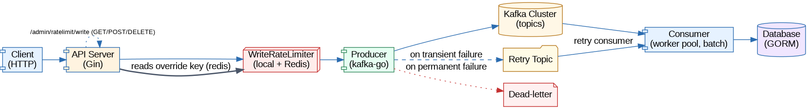
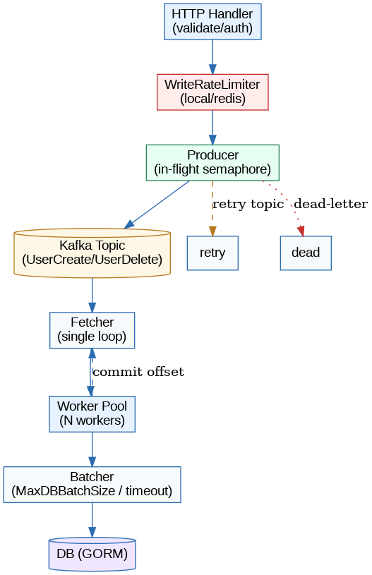
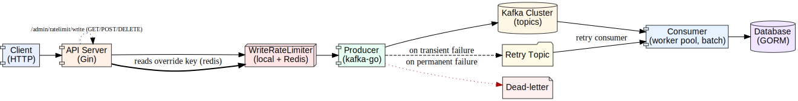
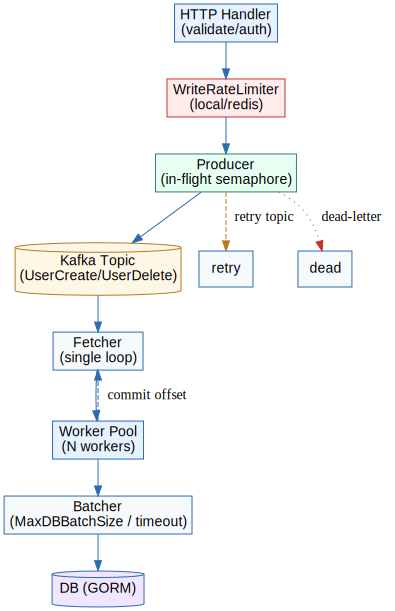

cdmp-mini — 架构、流程与 API 文档

说明

- 版本：基于仓库当前 master 分支（`cdmp-mini` 模块）2025-10-05 的代码实现。
- 目标读者：开发者、SRE 与运维工程师。

目录

1. 概览
2. 关键组件与职责
3. 运行时数据流（写入 / 消费）
4. 路由与 API 说明
   - 公共业务接口（/v1/users）
   - 管理接口（/admin/ratelimit）
   - 系统接口（/healthz, /version）
5. 配置项与运行参数（重点）
6. Redis / Kafka / DB 相关约定（键名 / topic）
7. 可观测性（Metrics / Logs）
8. 运维操作与 Runbook（逐步放开限流、回退、排障）
9. 常见故障与排查要点
10. 代码位置参考（重要文件与函数）

1. 概览

cdmp-mini 的核心架构采用异步写入流水线，目的是在高并发写入场景保护上游 API 服务并把持久化交给下游消费者完成。
11. Diagrams

本节包含 PlantUML 文件的引用，文件位于仓库的 `doc/plantuml/` 目录。

- PlantUML 源文件：
  - `doc/plantuml/producer.puml`
  - `doc/plantuml/consumer.puml`
  - `doc/plantuml/write_limiter.puml`

- 渲染与说明：请参阅 `doc/plantuml/README.md` 中的渲染命令（支持本地 plantuml.jar、Docker 或 VSCode 插件）。

渲染后的图片（嵌入）

以下 PNG 图片已使用仓库内 `doc/plantuml/plantuml.jar` 渲染并保存在 `doc/plantuml/` 目录，文档中直接引用相对路径：



Overall 系统级数据流（Client -> API Server -> Producer -> Kafka -> Consumer -> DB），简化展示关键组件与失败路径，便于快速掌握系统边界与控制点。



Producer 与 Consumer 的核心子流程（请求处理 -> 限流 -> Producer -> Kafka -> Fetcher/Worker -> 批量写入 DB），更紧凑、便于 SRE 快速阅读与排查。

注意：在本次渲染运行环境中未安装 Graphviz 的 `dot` 可执行文件，PlantUML 会退回到仅生成序列图或简化的布局；若需要更复杂的布局或更高质量的渲染，请在具备 `dot` 的环境中重跑渲染（参见 `doc/plantuml/README.md`）。

高质量矢量图 (SVG)：如果你的 Markdown 渲染器支持 SVG，优先使用下面的文件以获得缩放与更清晰的展示：





 Diagrams 注释（失败模式与监控建议）

 1) Producer sequence 注释
 - 关键步骤：Handler -> sendUserMessage -> sendWithRetry -> acquire inFlightSem -> kafka.Writer.WriteMessages -> (success | retry flow -> retry topic | dead-letter)
 - 可能的失败模式：
   - 无法获得 inFlightSem（信号量耗尽）——表现为上游请求返回 5xx 或特定错误："producer in-flight limit reached"。
   - kafka.Writer 写入失败（网络/leader/ISR 问题）——会进入重试路径并可能推送到 retry topic 或最终推到 dead-letter。
   - 写入延迟过高导致请求超时（上游阻塞或超时）——产生高延迟和连接积压。
 - 建议监控点：
   - kafka_producer_inflight_current（Gauge）：监控接近 ProducerMaxInFlight 的比例（报警阈值：>80%）。
   - kafka_producer_failures_total / kafka_producer_retries_total：监控写失败与重试率。
   - DeadLetterMessages：当该值上升表示有大范围写入失败或消息内容问题。
   - 上游 HTTP 请求延迟与 5xx 率。
 - 应对与缓解建议：
   - 临时降低全局写限流（通过 admin API）以降低入流速率。
   - 检查 Kafka 集群健康（leader、ISR、网络），并提升 ProducerMaxInFlight 或水平扩展 producer 仅在确保下游可承受时进行。
   - 若大量进入 dead-letter，需要回溯失败原因（序列化错误、消息格式）并修复数据或回放。

 2) Consumer sequence 注释
 - 关键步骤：Fetcher FetchMessage -> 派发到 Worker -> Worker 处理（或提交到 batchCh）-> 批量写入 DB 或单条写入 -> commitWithRetry
 - 可能的失败模式：
   - FetchMessage 长时间失败（Kafka broker 不可用或网络中断）——fetcher 重试并可能阻塞消费。
   - Worker 处理失败（DB 写入错误、约束冲突）——会触发重试或走重试/dead-letter 逻辑，造成消费吞吐下降。
   - 批量写入导致单笔慢查询或锁竞争——整个批次延迟上升，consumer lag 增大。
   - commitWithRetry 长时间失败（提交位移失败）——会导致重复消费或偏移提交延迟。
 - 建议监控点：
   - kafka_consumer_lag（GaugeVec）：关键指标，持续升高表明消费追不上生产。
   - kafka_consumer_processing_errors / ConsumerRetryMessages / ConsumerDeadLetterMessages：监控消费错误与重试/死信率。
   - DB 95/99 延迟与慢查询数量（数据库层监控）。
   - ConsumerCommitSuccess / ConsumerCommitFailures：提交位移成功率。
 - 应对与缓解建议：
   - 当 lag 持续上升：首先检查 DB 是否成为瓶颈（慢查询、锁），若是优化 SQL 或增加 DB 资源；否则增加 consumer 实例或 workerCount
   - 如果批量写入导致锁竞争，尝试减小 MaxDBBatchSize 或分散写操作（按分区/键范围）
   - 对 commit fail 做短期重试和告警，避免长时间重复消费造成业务侧副作用

 3) WriteRateLimiter 注释
 - 关键步骤：localRateCheck -> 读取 Redis 全局 override -> Eval Lua 脚本( INCR+EXPIRE 原子操作 ) -> 决策（允许 / 拒绝 / 回退到 local）
 - 可能的失败模式：
   - 本地限流触发（localRateCheck）——通常表示某一客户端或路径过热，直接返回 429
   - Redis 超时或可用性问题（短超时 150-200ms）——代码设计为回退到本地降级逻辑，但若本地也满则拒绝请求
   - Lua 脚本返回表明限流（redis_limit）——全局限流生效
 - 建议监控点：
   - write_rate_limiter_total (按 path, reason 分组)：统计 local_rate / redis_limit / redis_timeout 的拦截次数
   - Redis latency 与错误率（集群层面监控）
   - API 层 429 率与请求 QPS
 - 应对与缓解建议：
   - 若出现大量 redis_timeout，应检查 Redis 集群（慢命令、网络、资源），并考虑增加本地缓存短期缓解或提高 Redis 可用性。
   - 对于频繁本地限流的路径，考虑在客户端或网关层做更早的限流或拆分高成本操作。
   - 结合 ConsumerLag 指标判断是否需要调整全局 limit（降低或放开），并使用渐进放开的策略（+10-20% 步进并观察）。


主要流程：客户端 -> apiserver (HTTP) -> 将写操作消息写入 Kafka（producer） -> consumer 从 Kafka 消费并写入数据库/缓存。

为防止写入洪峰导致 DB 与消费者压力过大，服务端实现了多层保护：
- API 层的本地与分布式写入限流（Redis 动态全局限流 + 本地快速降级）；
- 生产者侧的 in-flight 并发限制（同步发送上限，快速失败以施加背压）；
- 消费者侧的并发/批量写入与 lag 监控，超过阈值则通过 LagProtect 中间件拒绝写入（返回 429）；
- 管理端点允许在运行时通过 Redis 动态调整全局写限流。


2. 关键组件与职责

- apiserver (GenericAPIServer)
  - 框架：Gin
  - 职责：HTTP 路由、认证、输入校验、把写操作序列化为 Kafka 消息并调用 producer。
  - 中间件：LoginRateLimiter、WriteRateLimiter、LagProtect、认证、验证中间件。

- Producer (UserProducer)
  - 使用：github.com/segmentio/kafka-go Writer
  - 特性：可配置 BatchSize/BatchTimeout/RequiredAcks；同步发送受 inFlightSem 控制以提供背压；失败会发送到重试 topic 或 dead-letter。

- Consumer (UserConsumer)
  - 使用：kafka-go Reader
  - 特性：单 fetcher + worker pool 模式，支持对 create/delete 批量写入 DB（MaxDBBatchSize），并有 commitWithRetry 机制保证消费位移提交可靠性；提供 lag monitor 能把实例置为 lagProtected。

- RedisCluster (storage.RedisCluster)
  - 用途：分布式全局限流键、缓存、管理端 key 存储（meta 信息）、本地降级辅助。Redis 操作使用短超时（150-200ms）以避免阻塞请求。

- Metrics (Prometheus)
  - 指标：ProducerInFlightCurrent、WriteLimiterTotal、ConsumerLag、ProducerFailures、DeadLetterMessages、各类计时与计数指标（详见 metrics.go 文件）。

- Admin API
  - 提供 `/admin/ratelimit/write` 的 GET/POST/DELETE，用于在运行时查看/设置/删除全局写入限流键。
  - 支持通过 `--server.admin-token` 配置单一管理 token；若未配置 token，默认只允许本地或 debug 模式访问。


3. 运行时数据流（写入 / 消费）

写入路径（HTTP 请求流）
- 客户端发起 HTTP POST /v1/users 或 DELETE /v1/users/:name/force
- 请求经过认证与输入校验。
- 中间件顺序（关键）:
  - LagProtect：若消费者处于保护模式（lagProtected），会直接返回 429。
  - WriteRateLimiter：先检查本地快速限流，再短超时读取 Redis 全局限流键（ratelimit:write:global_limit）并根据 Lua 原子脚本判断是否允许。
- Controller 调用 UserProducer.* 方法把消息封装为 kafka.Message 并调用 sendWithRetry（会受 inFlightSem 控制）。

Kafka 写入（Producer）
- Producer 尝试非异步同步写入（Async=false），WriteMessages 阻塞或失败时会走 retry 路径（发送到 retry topic 或 dead-letter）。
- inFlightSem 是一个带缓冲的 channel，其大小由 `ProducerMaxInFlight` 决定；当已满时，sendWithRetry 快速返回错误并由上层返回失败给调用方，形成背压。

消费与持久化（Consumer）
- Consumer 使用单 fetcher 循环 FetchMessage，再把消息派发到 worker pool 处理。
- 对于 Create/Delete 操作，会把消息放到批处理通道（batchCh），由批处理 goroutine 根据 `MaxDBBatchSize` 或 `BatchTimeout` 将消息合并后写入 DB（reduce transactions）。
- 处理完成后，fetcher 调用 commitWithRetry 提交位移（有重试机制）。
- Consumer 运行间会定期检查 lag（Kafka topic latest offset - consumer committed offset），当超过 `LagScaleThreshold` 时将 `lagProtected` 设为 true，影响 LagProtect 中间件。


4. 路由与 API 说明

基础系统接口
- GET /healthz
  - 返回：{"status":"ok"}
  - 用途：健康检查

- GET /version
  - 返回版本信息（来自 nexuscore/version）

业务 API: /v1/users
（注意：实际 API 在 `internal/apiserver/control/v1/user` 中定义的 controller）

- POST /v1/users
  - 描述：创建用户（异步）
  - 中间件：LagProtect, WriteRateLimiter, 认证, 验证
  - 请求体：application/json, 具体字段参见 api v1.User 定义（nexuscore api）
  - 返回：同步确认（通常为 200/202），实际持久化由 consumer 完成

- DELETE /v1/users/:name/force
  - 描述：强制删除用户（异步写入 Kafka）
  - 中间件：LagProtect, WriteRateLimiter
  - 返回：同步确认（202 或 200），consumer 负责最终删除

- DELETE /v1/users/:name
  - 描述：普通删除（不强制），路径受 controller 逻辑控制

- GET /v1/users and GET /v1/users/:name
  - 读取 API，由 controller 直接查询（DB/Cache）并返回同步结果

管理 API: /admin/ratelimit/write
- GET /admin/ratelimit/write
  - 权限：默认本机或 debug；若 `--server.admin-token` 配置了 token，则需在 `X-Admin-Token` header 提供正确 token（实现可根据策略调整）。
  - 返回示例：{ "value": "2000", "ttl_seconds": 3599, "source": "token" }
    - value: 当前限流值（string）
    - ttl_seconds: 剩余秒数（int）
    - source: 谁设置的（token 或 IP 或 unknown 或 no_redis）

- POST /admin/ratelimit/write
  - Body: {"value": <int>, "ttl_seconds": <int, optional>} (Content-Type: application/json)
  - 行为：写入 Redis 键 `ratelimit:write:global_limit`，并写入同名 meta 键 `ratelimit:write:global_limit:meta` 保存 source 信息；如果 TTL > 0 则 key 有过期时间。
  - 授权：若配置 AdminToken，需要提供 `X-Admin-Token`。否则仅允许本机或 debug 模式访问。
  - 返回：{"result":"ok"}

- DELETE /admin/ratelimit/write
  - 行为：删除 `ratelimit:write:global_limit` 与 meta 键
  - 授权：与 POST 相同
  - 返回：{"result":"deleted"} 或 {"result":"no_redis"}


5. 配置项与运行参数（重点）

主要配置文件/代码位置：`cdmp-mini/internal/pkg/options/kafka_options.go` 与 `cdmp-mini/internal/pkg/options/server_run_options.go`。

重要参数及建议：
- KafkaOptions.BatchSize (默认 100)
- KafkaOptions.BatchTimeout (默认 100ms)
- KafkaOptions.RequiredAcks (默认 -1)
- KafkaOptions.ProducerMaxInFlight (默认 1000)
- KafkaOptions.WorkerCount (默认 16)
- KafkaOptions.MaxDBBatchSize (默认 100)
- KafkaOptions.LagScaleThreshold (默认 10000)
- ServerRunOptions.AdminToken (管理 API 的简单访问 token，默认空 — 仅允许本机或 debug)

这些参数可通过命令行 flags（AddFlags）或环境变量（部分 Kafka 设置）调整，`NewKafkaOptions().Complete()` 会合并默认值。


6. Redis / Kafka / DB 相关约定（键名 / topic）

Redis 键
- 分布式写限流键（可配置前缀）：`<KeyPrefix>ratelimit:write:global_limit`
- 附属 meta：`<KeyPrefix>ratelimit:write:global_limit:meta`（保存 source）
- 本地限流可能使用类似 `ratelimit:write:<clientip>:<path>`（实现通过 buildRedisKey/identifier 组合）

Kafka topic（常量在代码中定义）：
- UserCreateTopic
- UserUpdateTopic
- UserDeleteTopic
- UserRetryTopic
- UserDeadLetterTopic

数据库（GORM）
- Consumer 直接使用 GORM 的 DB 实例来执行 create/update/delete 操作；create/delete 有批量写实现以减小事务与 IO 压力。


7. 可观测性（Metrics / Logs）

Prometheus 指标（部分重点）
- kafka_producer_inflight_current (gauge) — 当前 producer 同步 in-flight 数量
- write_rate_limiter_total (countervec: path, reason) — 被写入限流拦截次数（本地/redis）
- kafka_consumer_lag (gaugevec: topic, group) — consumer lag
- kafka_producer_failures_total, kafka_producer_success_total, kafka_dead_letter_messages_total
- consumer 及业务处理时间直方图与计数器（详见 `internal/pkg/metrics/metrics.go`）

日志
- 采用仓库内 `pkg/log`，重要操作（限流、producer write errors、consumer retry、dead-letter）有 debug/warn/error 记录。

建议监控/告警
- 监控 ConsumerLag、DB 95/99 延迟、ProducerInFlightCurrent（接近阈值时报警）、WriteLimiterTotal 增长过快。
- 告警触发示例：ConsumerLag > LagScaleThreshold 或 DB 99th latency 超预期、ProducerInFlightCurrent > 0.8 * ProducerMaxInFlight。


8. 运维操作与 Runbook（重点步骤）

场景：扩容后逐步放开全局限流（摘自 recommendations 文档）

步骤概览：
1) 等待消费者 re-balance 并观察 ConsumerLag 降到安全区间
2) 以步进方式（例如 +20%）调整 `ratelimit:write:global_limit` 并观察 2~5 分钟
3) 若一切稳定继续放开，若出现异常立即回退到上一步安全值
4) 记录成功后的安全阈值到运维 Runbook

命令示例（假设 apiserver 在 apiserver.example.com:8080 并配置 AdminToken）：

```bash
export ADMIN_TOKEN=admin-token-EXAMPLE-123
# 查询
curl -sS -X GET "http://apiserver.example.com:8080/admin/ratelimit/write" -H "X-Admin-Token: ${ADMIN_TOKEN}" | jq .
# 设置
curl -sS -X POST "http://apiserver.example.com:8080/admin/ratelimit/write" -H "Content-Type: application/json" -H "X-Admin-Token: ${ADMIN_TOKEN}" -d '{"value":2400, "ttl_seconds":3600}' | jq .
# 删除
curl -sS -X DELETE "http://apiserver.example.com:8080/admin/ratelimit/write" -H "X-Admin-Token: ${ADMIN_TOKEN}" | jq .
```

监控查询（示例 PromQL）
- Consumer lag（topic=mytopic, group=mygroup）:
  - kafka_consumer_lag{topic="users",group="cdmp-consumer"}
- Producer in-flight:
  - kafka_producer_inflight_current
- 写限流拦截速率（按路径）:
  - sum(rate(write_rate_limiter_total[1m])) by (path, reason)

紧急回退
- 立刻把 global_limit 设置为较小值（例如当前的一半）或删除 key（DELETE），并通知 SRE
- 暂停或降级高成本 API（如强制删除）直到系统恢复


9. 常见故障与排查要点

故障：写入端出现大量 500 或 429
- 排查顺序：
  1. 查看 WriteLimiterTotal 指标与管理 API 中的全局限流值
  2. 查看 ConsumerLag 是否快速上升
  3. 检查 Redis 可用性与 latency（代码使用短超时 150-200ms）
  4. 检查 ProducerInFlightCurrent 是否接近 ProducerMaxInFlight（若是，可能需要暂缓放开限流或增加 ProducerMaxInFlight）

故障：consumer 无法跟上（ConsumerLag 增长）
- 排查顺序：
  1. 检查 consumer 实例数量和 partition 数是否匹配
  2. 检查 DB 写入延迟与锁竞争
  3. 检查批量写入配置（MaxDBBatchSize、BatchTimeout）是否合适
  4. 检查是否存在大量重试/dead-letter 消息导致系统耗时

故障：Kafka 写入失败或 retries 大量增加
- 排查顺序：
  1. 检查 Kafka broker 状态与网络连通性
  2. 检查 producer 日志（ProducerFailures / DeadLetterMessages）
  3. 检查 RequiredAcks 配置是否与 broker ISR / cluster 健康一致


10. 代码位置参考（重要文件与入口）

- 路由与 server：
  - cdmp-mini/internal/pkg/server/router.go — 路由安装；中间件接入点（WriteRateLimiter、LagProtect）
  - cdmp-mini/internal/pkg/server/genericapiserver.go — server 启动、options 应用（查找该文件以了解启动流程）

- Producer：
  - cdmp-mini/internal/pkg/server/producer.go — UserProducer、sendWithRetry、inFlightSem 实现

- Consumer：
  - cdmp-mini/internal/pkg/server/consumer.go — UserConsumer、StartConsuming（fetcher + worker pool）、批量写入与 commitWithRetry

- 限流/中间件：
  - cdmp-mini/internal/pkg/middleware/common/write_limiter.go — 本地与 Redis 分布式限流逻辑
  - cdmp-mini/internal/pkg/middleware/common/lag_protect.go — LagProtect 中间件（检查消费者 lagProtected）

- 管理 API：
  - cdmp-mini/internal/pkg/server/ratelimit_admin.go — GET/POST/DELETE /admin/ratelimit/write

- 配置：
  - cdmp-mini/internal/pkg/options/kafka_options.go
  - cdmp-mini/internal/pkg/options/server_run_options.go

- 指标：
  - cdmp-mini/internal/pkg/metrics/metrics.go


附录 — 快速联系点

- 常用日志级别：Debug / Info / Warn / Error。发生生产问题请先把服务日志级别设置为 Debug（有性能开销）以获取更多上下文。
- 若需自动扩容建议：以 ConsumerLag 与 DB 99th latency 为指标触发 HPA（需在外部实现自动扩容控制器）。


—— 文档结束 ——
